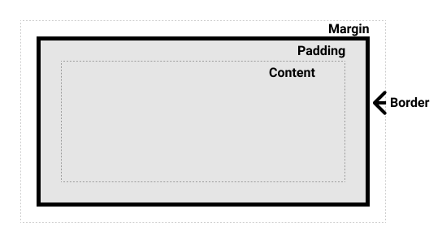
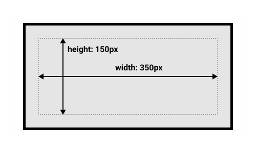
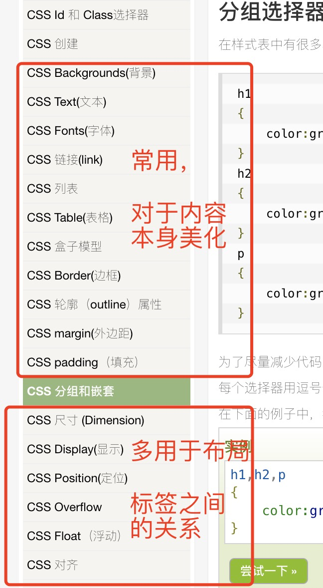
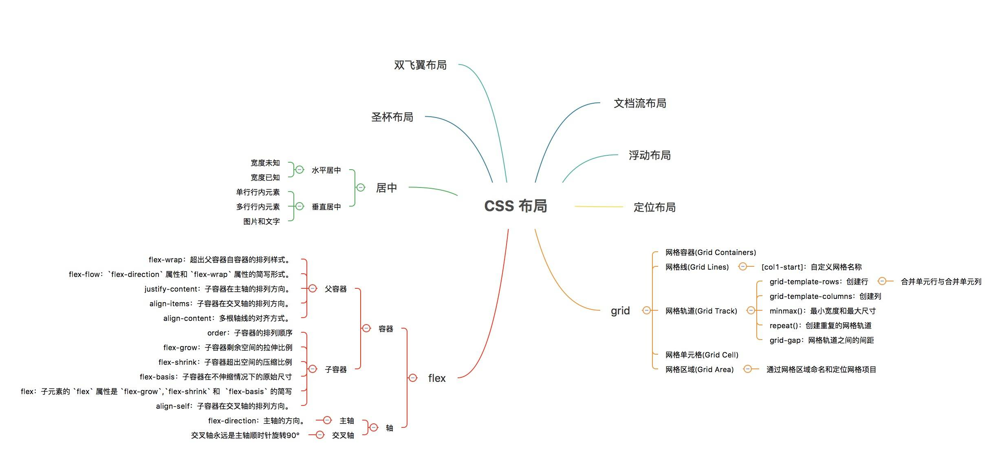

# CSS作用与历史定位
从历史角度看css发展，大致为下面几个阶段。同样也是学习的切入点。
1. 美化页面，美化标签
2. 布局
3. 接替部分js事件 - 伪选择器
4. 动画
5. 媒体查询与响应式
6. css也需要 - 变量
    * node下的几种实现 sass less sess什么的。。。
    * 原生支持变量

## 如何去理解CSS
### 一、 CSS的各种版本 - 1.0, 2.0, 3.0, 4.0
不要纠结版本问题，其实就是浏览器不兼容，导致的混乱，

使用当下浏览器普遍支持的技术即可
### 二、 CSS与html，js之间的关系
其实，CSS本身与Html，js没有直接关系，CSS只是浏览器使用的一部分绘制功能，

如果把这部分功能拿出来，实现到某种绘图工具或者软件中，CSS，依然还是CSS。

---

# 使用方式

* 语法 [go to learn](https://www.runoob.com/css/css-syntax.html)
* 使用 [go to learn](https://www.runoob.com/css/css-howto.html)

写在哪：
1. 写在标签上 
    - 学名：行内样式，内联样式(Inline style)
2. 写在html里 - 写在 `<style>`标签中
    - 内部样式表(Internal style sheet)
3. 单独写成文件，导入到html里 - 使用`<link>`，让浏览器下载，加载
    - 外部样式表(External style sheet)

> **拒绝行内样式**
> 
> 当下基本不在标签上写行内样式, 主要还是不利于后期的开发与调试，容易导致查了n个文件，花了几个小时找不到bug的情况

除了行内样式，其它css如果想作用到某个，某些标签中，需要使用html的 id 与 class 属性

学名为：css选择器

## 选择器
[go to learn](https://www.runoob.com/css/css-id-class.html)

要点：
1. 其本质就是一个查询算法，遍历所有标签，根据规则找到对应的html标签。
2. 常用的就是 标签， id， class 三种形式的单一使用

进阶：选择器查询，不是只能单调的查询id，class什么，而是可以使用复杂的语法结构，精准查询。（[go to learn](https://www.runoob.com/css/css-combinators.html)）


### 伪选择器

# 核心概念 css 模型盒
> [MDN 盒模型](https://developer.mozilla.org/zh-CN/docs/Learn/CSS/Building_blocks/The_box_model)

超简化记忆
* 块级盒子 (block box)  在布局里有体积，吃掉一行
    * 标题(`<h1>`等)和段落(`<p>`)默认情况下都是块级的盒子。
    * 换行
    * width 和 height 属性可以发挥作用
* 内联盒子 (inline box) 在布局里像是文字，顺序排列
    * 用做链接的 `<a>` 元素、 `<span>、 <em>` 以及 `<strong>` 都是默认处于 inline 状态的。
    * 不换行。
    * width 和 height 属性将不起作用

## 完整的 CSS 盒模型应用于块级盒子


* 定位时，多数使用margin，外边框
* 调整圆角，圆形等，对border调整
* padding内边框看情况使用
* content，是真正的内容区域
* 真实宽度是 content+padding+border大小，不算margin
    * 但是外边框margin确实影响了外在大小

## 标准模型 - 细节
在标准模型中，如果你给盒设置 width 和 height，实际设置的是 content box。 padding 和 border 再加上设置的宽高一起决定整个盒子的大小。 见下图。

假设定义了 width, height, margin, border, and padding:
```css
.box {
  width: 350px;
  height: 150px;
  margin: 25px;
  padding: 25px;
  border: 5px solid black;
}
```
如果使用标准模型宽度 = 410px (350 + 25 + 25 + 5 + 5)，高度 = 210px (150 + 25 + 25 + 5 + 5)，padding 加 border 再加 content box。


---

# 具体个属性内容细节
这部分只能多用，多练，不要死记硬背，要点就是，“应该有”。

比如背景图片不能铺满满屏，必然应该有”拉伸“，”重复“，这种支持。毕竟都2020年了。



[go to learn](https://www.runoob.com/css/css-background.html)

# 必会：圆角与圆 -> 按钮与头像
因为在窗口程序下UI，图片都是方形区域组合，对于圆角的追求，要么使用圆形的图片，要么对图片进行剪裁，

透过css的变换，可以减少各种图片大小，形状的数量，直接一张图适配各种场景。
* 多数情况下就是折腾border **圆角与圆**
    * 圆角按钮
    * 圆形头像
* 多数时候还有shadow，阴影的支持

> 外链
> * [CSS3圆角详解](http://www.ruanyifeng.com/blog/2010/12/detailed_explanation_of_css3_rounded_corners.html)
> * [CSS3 边框](https://www.w3school.com.cn/css3/css3_border.asp)
> * [CSS 按钮](https://www.runoob.com/css3/css3-buttons.html)
> * [用CSS剪切圆形图片](https://segmentfault.com/a/1190000003931845)


---
# 必会：布局
这里我们把响应式放在第一位。因为没有一种布局能满足我们的所有期待。切记在排布内容时提出苛刻要求，

比如：
* 对所有东西都期待，既要满足自适应，又要限定大小
* 各个手机上头像看来都一样大

诸如此类的问题。对情事过分苛刻，其实也是没见识的表现。
## 一、关于响应式
> 总结性归纳，
> 
> 使用css 的 media属性，if各种条件使用不同布局css属性，加上弹性的布局，多种大小的图片
>
> 实现不同情况下的风格统一

```css
@media screen and (min-width: 800px) {
  .container {
    margin: 1em 2em;
  }
} 
```

“响应式设计”这个词是Ethan Marcotte在2010年首度提出的，他将其描述为三种技术的混合使用。
* 第一个是液态网格，
* 第二个是液态图像的理念。通过使用相当简单的将设置max-width属性设置为100%的技术，图像可以在包含它们的列变得比图像原始尺寸窄的时候，缩放得更小，但总不会变得更大。这使得图像可以被缩放，以被放到一个灵活尺寸的列，而不是溢出出去，同时也不会在列宽于图像的时候，使图像变得太大以至于画质变得粗糙。
* 第三个关键的组件是媒体查询。
    * 可以只使用CSS实现。
    * 同所有尺寸的屏幕都使用一种布局不同的是，布局是可以改变的：侧栏可以在小屏幕上重新布局，而替代用的导航栏也可以显示出来。

> [练习视频](https://www.youtube.com/watch?v=4Av7ma4v46Y&ab_channel=FullstackDevelopment)

---

## 二、关于布局
[MDN](https://developer.mozilla.org/zh-CN/docs/Learn/CSS/CSS_layout/Introduction)

1. 没有绝对的定式，各种方案混合是很正常的。根据当时的情况使用。多练习，
2. 布局与css布局，是两件事儿
    * 比如：栅格化， 框架bootstrap可以实现，flex属性、grid属性也可以
3. 响应式就是多几套布局属性。从而实现多宽度窗口的适配。
    * 所以不要钻牛角尖，一定完美适配什么

> 摘抄一图
> 

* 非css布局
    * 普通html标签自带的css属性（块元素罗列）
    * 依赖html的table标签，用单元格布局
* 浮动布局，div + float属性，浮动每个块元素
    * 需要一个clear属性，清除浮动方向
    * 框架Bootstrap v3之前是用此方式实现的栅格化
* position属性定位块元素
    * 优点快速，位置绝对，
    * 缺点，依赖于窗口本身，自适应效果差，
* flex 一种根据属性大小，分割垂直，水平方向内容的属性
* css自带的grid属性

---
# 必会：选择器（替代js的伪事件）
其实布局中提到的响应式，也是一种伪事件的标签，触发并不是由js来完成的。而是css自带的机制。

在css，js都不是很健全的年代，js既要完成动画效果，又要完成业务的处理。随着技术发展，css分摊了很多关于UI上的问题。逐步增加了，“事件、动画、变量”等等的支持。

要点：单纯的CSS就是对UI，对计算图形的单纯问题，远比js处理来的高效率，但是，非常复杂的UI问题，还是离不开js。

最常用于：
* 响应式布局
* 鼠标悬停、鼠标点击等等，配合，是否可见属性，
    * 实现菜单
    * 实现按钮高亮

[其它稍作了解即可](https://www.runoob.com/css/css-pseudo-classes.html)

# 进阶：动画
> (这部分属于更为专业的UI，一般情况下，都是摘抄或使用三方库)

2021年的当下，css动画基本都兼容了。能css完成的动画，尽量不麻烦js配合timer进行循环，用程序实现，

2D图形下，空间中，动画可以拆解为3种方式的组合体：
1. 大小变化，比如正方形的长宽变化（Scale）
2. 旋转，根据自身中心点旋转（rotate）
3. 相对于自身原来的位置，位置移动，（translate）
从色彩角度，就是颜色的过渡，大致是
1. 颜色变化，
2. 透明度变化
由于HTML技术角度下UI都是二维空间，3d动画，也是模拟效果，主要就是Z轴的旋转，或者说，是2d图形的透视效果，主要就是：
* rotateX
* rotateY
然后，配合css的过渡属性，完成动画
* [CSS3 过渡](https://www.runoob.com/css3/css3-transitions.html)
* [CSS3 动画](https://www.runoob.com/css3/css3-animations.html)

细节与demo：
* [CSS3 2D 转换](https://www.runoob.com/css3/css3-2dtransforms.html)
* [CSS3 3D 转换](https://www.runoob.com/css3/css3-3dtransforms.html)
* [CodePen Home CSS3颜色渐变动画](https://codepen.io/JrontEnd/pen/AXrVvX)

复杂Demos
* [15个CodePen上启发灵感的CSS动画案例](https://webdesign.tutsplus.com/zh-hans/articles/15-inspiring-examples-of-css-animation-on-codepen--cms-23937)


# 进阶：变量，自动属性，等
> 1. 这部分属于更为专业的UI，一般情况下，都是摘抄或使用三方库
> 2. 而且现有的三方项目，用到的也不是特别多
> 3. 太新，兼容性会有些问题

早期的css主要用于对标签的样式变动，并没有程序的属性，随着web的发展，前端越发的复杂，js更多的去承担业务逻辑比较合理，

但是，css又没有变量机制，所以催生了各种 sass sess less等等技术手段，让css样式更为组织化，结构化。

随后，css原生支持变量变应运而生。
```css
:root {
/* 
格式就是 
    --xxxx: 值;
*/
  --first-color: #488cff;
  --second-color: #ffff8c;
}

#firstParagraph {
    /* 这里就能复用了 */
  background-color: var(--first-color);
  color: var(--second-color);
}

#secondParagraph {
  background-color: var(--second-color);
  color: var(--first-color);
}

#container {
  --first-color: #48ff32;
}

#thirdParagraph {
  background-color: var(--first-color);
  color: var(--second-color);
}
```

更多细节：
* [跟我一起全面了解一下CSS变量](https://zhuanlan.zhihu.com/p/65082165)
* [使用CSS自定义属性（变量）](https://developer.mozilla.org/zh-CN/docs/Web/CSS/Using_CSS_custom_properties)

# Links
* https://juejin.cn/post/6844903491891118087
* https://codepen.io/jieniu/pen/ENQmXL
* [响应式设计 link](https://developer.mozilla.org/zh-CN/docs/Learn/CSS/CSS_layout/Responsive_Design#%E5%93%8D%E5%BA%94%E5%BC%8F%E8%AE%BE%E8%AE%A1)